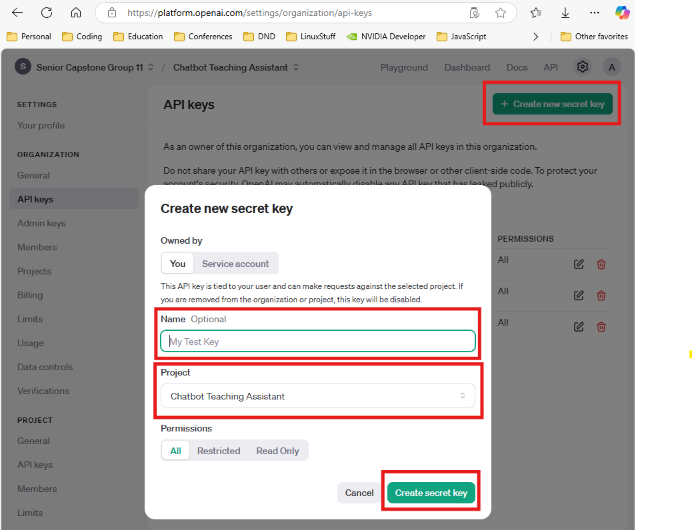
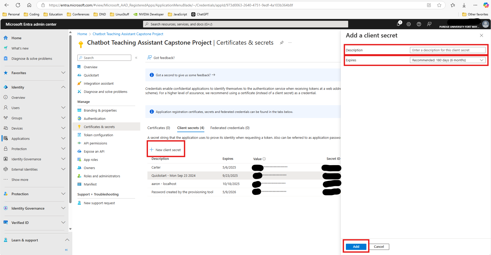
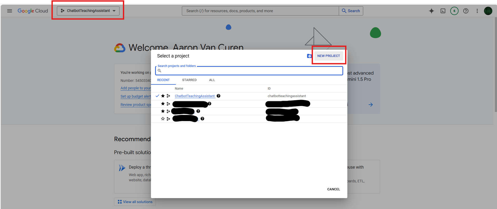
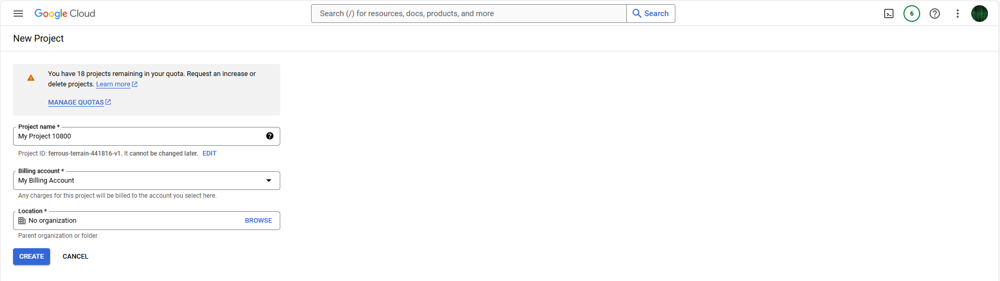
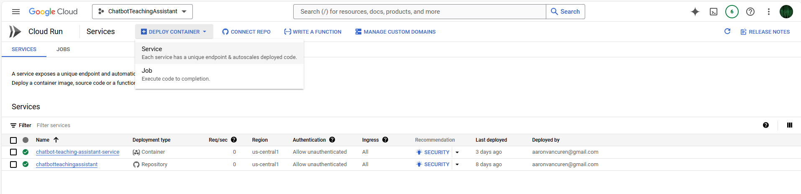
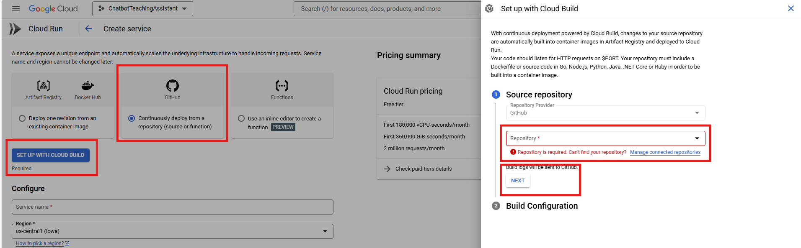
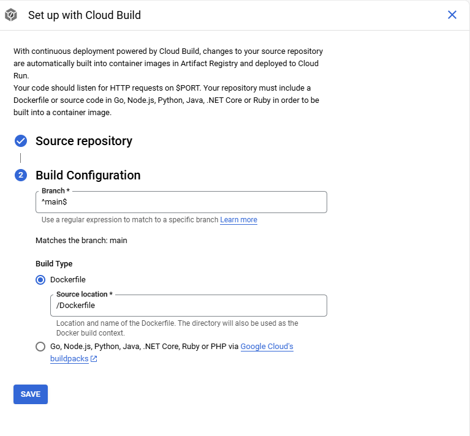
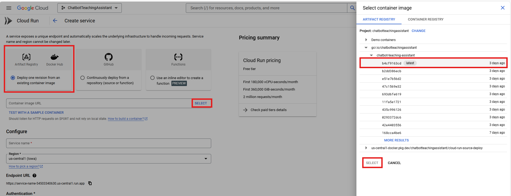
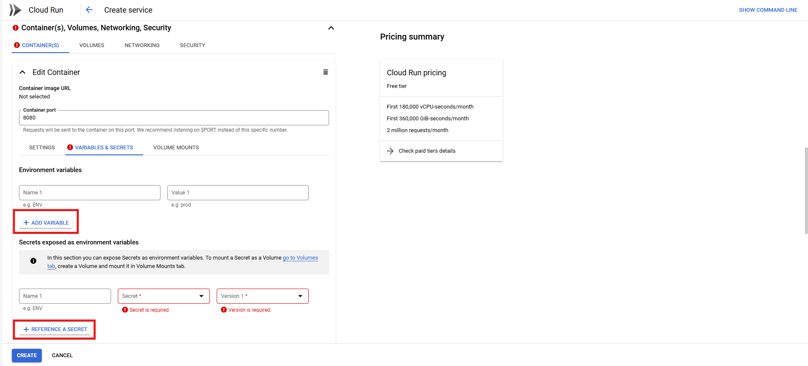

# Chatbot Teaching Assistant
The Chatbot Teaching Assistant is a tool for students and professors alike. It allows students to ask questions regarding enrolled course material including but not limited to lecures, homeworks, syllabi, related resources  without violating academic honesty. It allows professors to manage user access to courses and to provide course material to be used as context when answering student questions.

# Table of Contents
- [Installation Guide](#installation-guide)
- [How to Run](#how-to-run)
- [How to Use](#how-to-use)
- [How to Run Unit Tests](#how-to-run-unit-tests)
- [Credits](#credits)

# Installation Guide

This guide will help you set up the Chatbot Teaching Assistant application.

## Prerequisites

- [**Python 3.12**](https://www.python.org/downloads/release/python-3127/) installed.
- [**Docker**](https://docs.docker.com/desktop/setup/install/windows-install/) installed.

## Installation Steps

### 1. Clone the Repository

Open Git Bash or similar CLI and clone the repository:
```bash
git clone https://github.com/aaronvancuren/ChatbotTeachingAssistant.git
cd ChatbotTeachingAssistant
```

### 2. Create a Virtual Environment

Create a virtual environment to manage project dependencies:

- **On Windows**:

  ```bash
  py -m venv venv
  ```

- **On Unix or MacOS**:

  ```bash
  python -m venv venv
  ```

Activate the virtual environment:

- **On Windows**:

  ```bash
  source venv/Scripts/activate
  ```

- **On Unix or MacOS**:

  ```bash
  source venv/bin/activate
  ```

When you're done, you can deactivate the virtual environment:

```bash
deactivate
```

### 3. Install Dependencies

Update pip to ensure latest version:

```bash
pip install --upgrade pip
```

Install the required Python packages:

```bash
pip install -r requirements.txt
```

### 4. Set Up Environment Variables

Create a `.env` file from the `template.env` file.

Follow the below instructions for obtaining sensitive environment variables.

#### Microsoft Entra Environment Variables
- Go to [Microsoft Entra](https://entra.microsoft.com/#view/Microsoft_AAD_RegisteredApps/ApplicationMenuBlade/~/Credentials/appId/973d0063-2640-4751-9edf-4a103b364b8f)
- Click "New client secret"
- Update the "Description" to identify the secret
- Update the "Expires" as needed.

#### OpenAI Environment Variables
- Go to [OpenAI Platform](https://platform.openai.com/settings/organization/api-keys) to create an API key.
- Click "Create new secret key"
- Provide a "Name"
- Select Chatbot Teaching Assistant as the "Project"
- Click "Create secret key"





#### Session Management
- Run the following command to generate a secret key
  ```
  openssl rand -hex 32
  ```

# How to Run

Start the server using Uvicorn:

```bash
uvicorn backend.main:app --host [ENTER HOST] --port [ENTER PORT] --reload
```

Alternatively, you can use run.py:
```bash
python run.py
```

> The `--reload` flag enables auto-reloading of the server when code changes for development purposes only.

## Using Docker
Steps for using a dockerfile.

# How to Use

## Application
Create screenshots of using the application in the web.

## **Swagger UI** and **cURL**.

**Using Swagger UI:**

FastAPI automatically generates interactive API documentation using Swagger UI. You can access it by visiting:

- **Swagger UI:** [http://127.0.0.1:8000/docs](http://127.0.0.1:8000/docs)
- **ReDoc UI:** [http://127.0.0.1:8000/redoc](http://127.0.0.1:8000/redoc)

These interfaces allow you to interact with your API directly from the browser.

1. Go to the Swager UI or ReDoc UI in your browser.
2. Find the `/chat` POST endpoint.
3. Click on "Try it out".
4. Enter a prompt in the JSON body, for example:

   ```json
   {
     "prompt": "Hello, how are you?"
   }
   ```

5. Click "Execute" to see the response from the API.

**Using cURL:**

```bash
curl -X POST "http://127.0.0.1:8000/chat" -H "Content-Type: application/json" -d "{\"prompt\": \"Hello, how are you?\"}"
```

# How to Run Unit Tests

The unittest module can be used from the command line to run tests:

...for modules
```bash
python -m unittest test_module1 test_module2
```

...for classes
```bash
python -m unittest test_module.TestClass
```

...for individual test methods
```bash
python -m unittest test_module.TestClass.test_method
```
# Setting up PostgreSQL Locally
Windows Install:

  Step 1: Download the Installer
    - Visit the official PostgreSQL download page: https://www.postgresql.org/download/windows/
    - Click on the "Download the installer" link, which will take you to the EnterpriseDB installer page.
    - Choose the version you want (e.g., PostgreSQL 16 is prefered for Google Cloud deployment) and download the appropriate installer for your system (32-bit or 64-bit).

  Step 2: Run the Installer
    - Locate the downloaded .exe file and double-click to run it.
    - If prompted by User Account Control (UAC), click "Yes" to allow the installer to make changes.

  Step 3: Follow the Installation Wizard
    1. Welcome Screen: Click "Next".
    2.Installation Directory:
      - Choose the directory where you want to install PostgreSQL (default is usually fine).
      - Click "Next".
    3. Select Components:
      - Ensure all components are selected (PostgreSQL Server, pgAdmin 4, Stack Builder).
      - Click "Next".
    4. Data Directory:
      - Choose where you want the data to be stored (default is fine).
      - Click "Next".
    5. Set Password:
      - IMPORTANT: Enter a password for the PostgreSQL superuser(postgres).
      - Remember this password for later use.
      - Click "Next".
    6. Port Number:
      - Default port is 5432.
      - Click "Next".
    7. Locale Settings:
      - Leave as default unless you have specific locale requirements.
      - Click "Next".
    8. Ready to Install:
      - Review the settings and click "Next" to begin the installation.
    9. Completing the Setup:
      - Wait for insatllation to complete.
      - Uncheck "Stack Builder" unless you need to install additional tools.

  Step 4: Verify the Intallation:
    - Open pgAdmmin 4 (a graphical administration tool for PostgreSQL).
    - You can find it in the Start Menu under PostgreSQL.
    - When prompted, enter the password you set for the postgres user. 

macOS Install:

  Option 1: Using the EnterpriseDB Installer
    Step 1: Download the Installer
      - Visit https://www.postgresql.org/download/macosx/
      - Download the macOS installer from EnterpriseDB.
    
    Step 2: Run the Installer
      - Open the downloaded .dmg file and run the installer package.
      - Follow the installation prompts, similar to the Windows installation.
      - Set a password for the postgres user when prompted.
  
  Option 2: Using Homebrew
    Step 1: Install Homebrew (if already not installed)
      - Open terminal and run: /bin/bash -c "$(curl -fsSL https://raw.githubusercontent.com/Homebrew/install/HEAD/install.sh)"
    
    Step 2: Install PostgreSQL
      - Open terminal and run:
        -brew update
        -brew install postgresql
    
    Step 3: Initialize and Start PostgreSQL
      - Open terminal and run the following (only if it's your first time) to initialize:
        - initdb /usr/local/var/postgres
      - Open terminal and run the following to start PostgreSQL
        - brew services start postgresql
    
    Step 4: Verify the Installation
      - Connect to PostgreSQL using the psql command-line tool:
        - psql postgres
      - If successful, you'll see the PostgreSQL prompt.

Linux Install:

  Step 1: Update the Package List
    -sudo apt update
  Step 2: Install PostgreSQL
    -sudo apt install postgresql postgresql-contrib
  Step 3: Verrify the Installation
    -sudo -i -u postgres
    -psql

Setting Up the Database:

  By default, PostgreSQL creates a superuser called postgres. We'll create a new database and user for our application.

  Step 1: Access the PostgreSQL Shell
    - For Windows and macOS using pgAdmin: You can execute SQL queries directly.
    - For command-line access use the following (Switch to the postgres user):
      - sudo -i -u postgres
    - To access psql from the postgres user:
      - psql

  Step 2: Create a New Database
    - CREATE DATABASE chatbot_db;

  Step 3: Create a New User
    - CREATE USER chatbot_user WITH PASSWORD 'your_password';
    - Replace 'your_password' with a strong password.

  Step 4: Grant Privileges
    - GRANT ALL PRIVILEGES ON DATABASE chatbot_db TO chatbot_user;
  
  Step 5: Exit psql (if using command line)
    - \q

Initializing the Schema:

  Step 1: Connect to the Database
    - psql -U chatbot_user -d chatbot_db
    - Enter your password when prompted.
  
  Step 2: Execute the Schema Script
    - \i /path/to/ChatbotTeachingAssistant/database/scripts/initialize_tables.sql
    - Replace /path/to with the explicit pathing to the ChatbotTeachingAssistant for your machine
  
  Step 3: Verrify the Tables
    - List the tables:
      - \dt
    - Check the schema of the table:
      - \d users

Configuring Environment Variables:

  Step 1: Set the required EVs found in the .env file with information created in previous steps. 

# Setting Up Google Cloud
- Go to [Google Cloud](https://console.cloud.google.com/)
- Create New Project
  - Select the current project in the upper left.
  - In the pop up, select "New Project"

    

- Follow the prompts and click "CREATE"

  

- Go to Cloud Run
  1. Create Repository Service to Create Docker Image.

      

    - Select "Continuously deploy from a repository (source or function)"
    - Click "SETUP WITH CLOUD BUILD"
    - Select a connected Repository
    - Click "NEXT"

      

    - Select "Dockerfile" as the Build Type
    - Use the default Source location

      

  2. Create Container Service to Deploy Docker Image

      

    - Select "Deploy one revision from an existing container image"
    - Click "SELECT" a Container image URL
    - Select the latest image created by the previous service
    - Click "Select"

      

    - Add Environment Variables and Secrets

      

# Troubleshooting

- **Module Not Found Error:**
  - Ensure your virtual environment is activated and all dependencies are installed.

- **OpenAI Authentication Error:**
  - Verify that your OpenAI API key is correctly set in the `.env` file.

- **Server Not Running:**
  - Check if Uvicorn is installed and the correct app module is specified in the command.

- **Cannot Access Swagger UI:**
  - Ensure the server is running without errors and you're visiting the correct URL: [http://127.0.0.1:8000/docs](http://127.0.0.1:8000/docs)

# Credits
- [Aaron Van Curen](https://github.com/aaronvancuren) - Software Engineer (2024-2025)
- [Neal Birchfield](https://github.com/The-Architect01) - Software Engineer (2024-2025)
- [Wright Ceresa](https://github.com/wrightceresa) - Software Engineer (2024-2025)
- [Carter Besson](https://github.com/CarterBesson) - Software Engineer (2024-2025)
- [Dr. Zesheng Chen](https://users.pfw.edu/chenz/) - Academic Advisor/Project Cosponsor
- [Computer Science Department of Purdue Fort Wayne](https://www.pfw.edu/etcs/computer-science) - Project Cosponsor